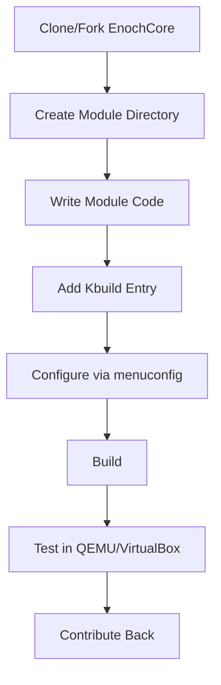

# How to Fork and Build Your Own OS with EnochCore

## 1. Fork the repository
- Use GitHub to fork EnochCore and clone it locally.

## 2. Add a new module
```sh
cd src/modules/
mkdir my_module
cd my_module
echo 'obj-m += my_module.o' > Kbuild
touch my_module.c
```

## 3. Implement module initialization
```c
#include <module.h>
MODULE_INIT(my_init);
void my_init(void) {
    // Your module code here
}
```

## 4. Build and configure
```sh
make menuconfig   # Select your module
make modules      # Build modules
make iso          # Build bootable image
```

## 5. Test in QEMU/VirtualBox
```sh
qemu-system-x86_64 -kernel kernel.bin
```

## 6. Share and contribute
- Open a pull request with your module and documentation.
- Follow code style and Doxygen documentation rules.

---

## Workflow: Module Development



---

**All code comments and documentation must be in English.**

---

Created by MelvinSGjr (GitHub) 