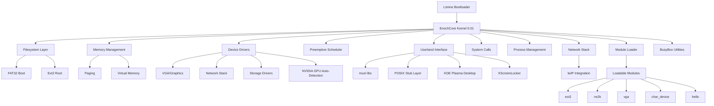
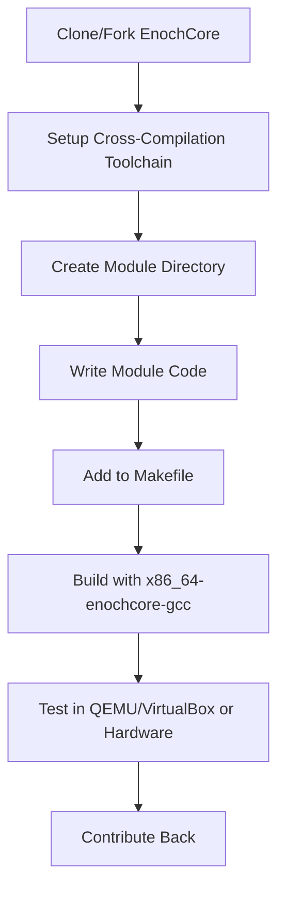

# EnochCore Modular Operating System

## Overview
EnochCore is a modular, extensible, and lightweight operating system (***THIS IS NOT LINUX OR BSD (Only Kernel based on BSD files)***) x86_64 POSIX-compliant operating system in C. It is designed for clarity, hackability, and community-driven development. EnochCore uses standard, efficient components and is easy to fork and extend

## Kernel
The EnochCore kernel is a monolithic x86_64 one written in relatively simple C with a few bits of Intel assembly here and there. It uses the Limine bootloader and leverages the FAT32 filesystem for booting along with Ext2 for the root partition.

**I made this using a [malwarepad](https://github.com/malwarepad)'s tutorial on [YouTube](https://www.youtube.com/watch?v=vjkiPU6QcWw)**

*All files will be available in the release*

---

## Architecture Diagram



---

## Lightweight by Design
- Uses [Musl libc](https://musl.libc.org/) for minimal and fast C library support (adapted for EnochCore).
- Init system: [OpenRC](https://github.com/OpenRC/openrc) (default), with optional systemd support.
- Core utilities provided by [BusyBox 1.36](https://busybox.net/).
- Modular, minimal kernel and userland.
- **KDE Plasma Desktop** - Full graphical environment ported from FreeBSD.
- **NVIDIA GPU Support** - Auto-detection for RTX/GTX series with legacy driver support.

---

## Build & System Management Tool
- EnochCore includes a build and management tool inspired by pmbootstrap.
- Features:
  - Automated cross-compilation of packages
  - Image generation for various devices
  - Chroot environment management
  - Easy configuration and scripting
  - **Cross-compilation toolchain**: x86_64-enochcore-gcc

**Example usage:**
```sh
export PATH="$HOME/opt/cross/bin:$PATH"
make clean
make -j$(nproc)
make install
```

---

## Modular Structure
```
src/
├── kernel/         # Core kernel code
│   ├── memory/     # Memory management (paging, vmm, malloc)
│   ├── drivers/    # Device drivers
│   │   ├── gpu/    # Graphics drivers (VGA, NVIDIA)
│   │   ├── nics/   # Network interface cards
│   │   └── disk/   # Storage drivers
│   ├── networking/ # Network stack (lwIP)
│   ├── filesystems/# File systems (FAT32, Ext2)
│   ├── modules/    # Loadable kernel modules
│   └── syscalls/   # System call interface
├── desktop/        # Desktop environment
│   ├── kde/        # KDE Plasma (ported)
│   └── kscreenlocker/ # Screen locking
├── libs/           # Libraries
│   └── musl_enochcore/ # Adapted musl libc
├── software/       # User applications
│   ├── calculator/ # Calculator app
│   ├── logic_designer/ # Logic designer
│   ├── busybox/    # BusyBox utilities
│   └── test/       # Test applications
├── init/           # Init system scripts (OpenRC, systemd)
└── tools/          # Build and development tools
```

---

## Init System
- Default: OpenRC for fast, parallel service startup.
- Optional: systemd support for advanced service management.
- All init scripts are in `src/init/`.

---

## BusyBox Utilities
- BusyBox 1.36 provides standard userland tools (ls, cp, sh, etc.) in a single binary.
- Located in `src/software/busybox/`.

---

## Desktop Environment
- **KDE Plasma** - Full desktop environment ported from FreeBSD
- **KScreenLocker** - Screen locking mechanism integrated with KDE
- Located in `src/desktop/`.

---

## GPU Support
- **NVIDIA Auto-Detection** - Automatically detects RTX 3060 Ti, RTX 3070, RTX 3080, RTX 3090
- **Legacy Support** - GTX 1660, GTX 1070, GTX 1080 with legacy drivers
- **Driver Management** - Automatic driver selection based on GPU detection
- Located in `src/kernel/drivers/gpu/`.

---

## Shell Interface
- Minimal text shell for user interaction.
- Entry point: `void shell_main(void);`
- Supports basic command parsing (e.g., `help`, `exit`).
- Easily extensible for custom commands.

---

## API Documentation
- All public APIs (drivers, FS, IPC, etc.) are documented in Doxygen format.
- To generate HTML docs and architecture diagrams:

```sh
doxygen Doxyfile
# Output: docs/html/index.html (with Graphviz diagrams)
```

---

## How to Fork and Extend EnochCore

### 1. Fork the repository
- Use the GitHub interface to fork EnochCore.

### 2. Add a new module
```sh
cd src/kernel/modules/
mkdir my_driver
cd my_driver
echo 'obj-m += my_driver.o' > Kbuild
touch my_driver.c
```

### 3. Implement module initialization
```c
#include <module.h>
MODULE_INIT(my_init);
void my_init(void) {
    // Your driver code here
}
```

### 4. Build and configure
```sh
export PATH="$HOME/opt/cross/bin:$PATH"
make clean
make -j$(nproc)
```

### 5. Test in QEMU/VirtualBox or on real hardware
```sh
qemu-system-x86_64 -kernel build/enochcore.elf
# Or flash to your device
```

### 6. Contribute back
- Open a pull request with your module and documentation.
- Follow code style and Doxygen documentation rules.

---

## Example: Creating a Driver (VGA)

```c
/**
 * @file vga.c
 * @brief VGA driver
 * @example
 * vga_putchar('X'); // Print character
 */
void vga_putchar(char c) {
    // Output a character to the VGA text buffer
}
```

---

## Workflow Diagram: Module Development



---

## Version Information
- **Current Version**: 0.01
- **Kernel**: Monolithic x86_64
- **Bootloader**: Limine
- **Filesystems**: FAT32 (boot), Ext2 (root)
- **Desktop**: KDE Plasma
- **C Library**: musl libc (adapted)
- **GPU Support**: NVIDIA (auto-detection)
- **Network**: lwIP stack
- **Build System**: GNU Make

Created by MelvinSGjr (GitHub)
