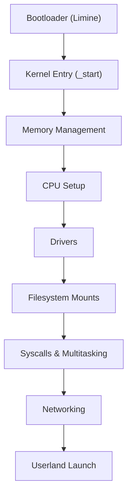
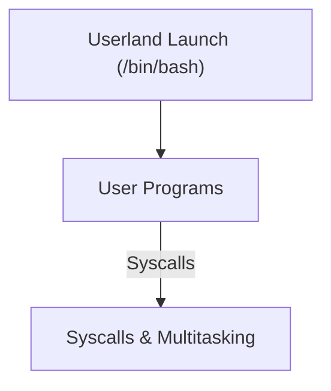

# EnochCore

EnochCore is a minimal, x86_64 POSIX-like operating system written in C. This project is for those who want to understand how an OS works from the ground up. No magic, no bloat, just code and documentation. Designed and maintained by MelvinSGjr.

*Digital folklore claims that EnochCore is an effort to replicate the "god system" - it is straightforward, fast, and uncomplicated. The ancient book about secret knowledge, the Book of Enoch, is referenced in the name. However, we are building an instrument rather than a temple, in contrast to the mystics of the past.*

**Origin:** EnochCore is based on the original source code of CavOS.

---

## System Overview

EnochCore is built to be transparent, hackable, and easy to reason about. The system is monolithic, with a clear separation between kernel and userspace. Every subsystem is implemented with simplicity and clarity in mind.

### Boot Process
- The system boots via the Limine bootloader, which loads the kernel into memory and passes control to the entry point (`_start`).
- Early initialization sets up serial output, parses bootloader data, and prepares the framebuffer for console output.

### Kernel Initialization
- **Memory Management:**
  - Physical (PMM) and virtual (VMM) memory managers are initialized first.
  - Paging is set up for process isolation and kernel protection.
- **CPU & Interrupts:**
  - GDT, IDT, and ISR handlers are installed.
  - APIC and ACPI are configured for multiprocessor and power management support.
- **Drivers:**
  - PCI bus is scanned and device drivers are loaded: AHCI (SATA), PS/2 keyboard/mouse, serial ports, VGA, framebuffer, and network cards (e1000, rtl8139, rtl8169, ne2k).
- **Filesystems:**
  - Virtual filesystems are mounted: `/dev`, `/`, `/boot`, `/sys`, `/proc`.
  - FAT32 and ext2 are supported for persistent storage.
- **Graphics:**
  - Console output is available via VGA and framebuffer, with ANSI color and basic font rendering.
- **Syscalls & Multitasking:**
  - Linux-like syscall layer is initialized for userspace communication.
  - Pre-emptive multitasking and process/thread management are enabled.
- **Networking:**
  - lwIP stack provides full TCP/IP support (IPv4/IPv6, PPP, Ethernet).
- **Userland Launch:**
  - After all subsystems are ready, `/bin/bash` is launched as the first user process.

### Userspace
- User programs are loaded as ELF64 binaries.
- Musl libc is used for standard C library support.
- All userspace programs interact with the kernel via syscalls.
- Example programs: shell, test utilities, graphics demos.

---

## Architecture Diagrams

### Boot & Kernel Init

### Userspace & Syscalls

---

## Subsystems Explained

### Memory Management
- PMM manages physical frames, VMM handles virtual address spaces.
- Paging is used for isolation and protection.
- Custom malloc implementation for kernel and user allocations.

### CPU & Interrupts
- GDT/IDT set up segment and interrupt descriptors.
- ISRs handle exceptions and hardware interrupts.
- APIC/ACPI for SMP and power management.

### Drivers
- PCI bus scanning and device enumeration.
- AHCI for SATA disks, PS/2 for keyboard/mouse, serial for debug.
- VGA and framebuffer for graphics output.
- Network: e1000, rtl8139, rtl8169, ne2k.

### Filesystems
- VFS layer abstracts all filesystems.
- FAT32 and ext2 for persistent storage.
- /dev, /proc, /sys as virtual filesystems for device and system info.

### Graphics
- Console output via VGA and framebuffer.
- ANSI color, PSF font rendering.

### Syscalls & Multitasking
- Linux-like syscall ABI for compatibility.
- Pre-emptive multitasking, process and thread management.
- Signals, pipes, futexes, eventfds, Unix sockets.

### Networking
- lwIP stack: TCP, UDP, IPv4, IPv6, PPP, Ethernet.
- Network drivers for common NICs.

### Userland
- Musl libc for C standard library.
- ELF64 loader, dynamic linking.
- Shell and test programs as examples.

---

## Philosophy
- Minimalism: only what is needed, nothing more.
- Transparency: code and docs are the only "magic".
- Hackability: easy to read, easy to change.
- For those who want to learn, not just use.

---

## Documentation
- [Contributing](docs/contributing.md)
- [Install & Build](docs/install.md)

---
Repository: https://github.com/MelvinSGjr/EnochCore
