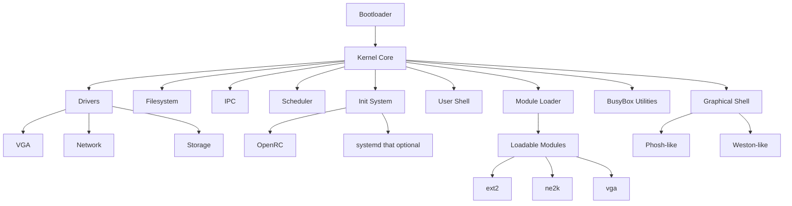
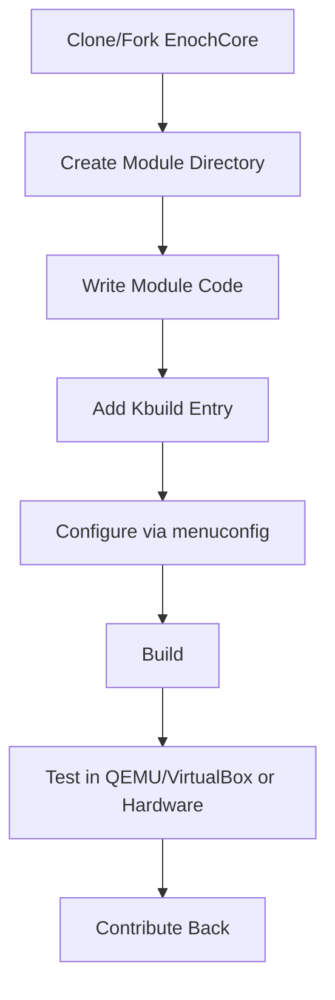

# EnochCore Modular Operating System

## Overview
EnochCore is a modular, extensible, and lightweight operating system for x86_64. It is designed for clarity, hackability, and community-driven development. EnochCore uses standard, efficient components and is easy to fork and extend.

---

## Architecture Diagram



---

## Lightweight by Design
- Uses [Musl libc](https://musl.libc.org/) for minimal and fast C library support.
- Init system: [OpenRC](https://github.com/OpenRC/openrc) (default), with optional systemd support.
- Core utilities provided by [BusyBox 1.36](https://busybox.net/).
- Modular, minimal kernel and userland.

---

## Build & System Management Tool
- EnochCore includes a build and management tool inspired by pmbootstrap.
- Features:
  - Automated cross-compilation of packages
  - Image generation for various devices
  - Chroot environment management
  - Easy configuration and scripting

**Example usage:**
```sh
./ecbootstrap init
./ecbootstrap build
./ecbootstrap install --device=qemu_x86_64
./ecbootstrap chroot
```

---

## Modular Structure
```
src/
├── kernel/         # Core kernel code
├── modules/        # Loadable modules (.ko)
│   ├── ext2/
│   ├── ne2k/
│   └── vga/
├── scripts/
│   └── kbuild/     # Modular build system
├── shell/          # Text interface (shell)
├── init/           # Init system scripts (OpenRC, systemd)
├── busybox/        # BusyBox utilities
└── ecbootstrap/    # Build and management tool
```

---

## Init System
- Default: OpenRC for fast, parallel service startup.
- Optional: systemd support for advanced service management.
- All init scripts are in `src/init/`.

---

## BusyBox Utilities
- BusyBox 1.36 provides standard userland tools (ls, cp, sh, etc.) in a single binary.
- Located in `src/busybox/`.

---

## Shell Interface
- Minimal text shell for user interaction.
- Entry point: `void shell_main(void);`
- Supports basic command parsing (e.g., `help`, `exit`).
- Easily extensible for custom commands.

---

## Graphical Shell Testing
- EnochCore supports graphical shell emulation for development and testing.
- Test graphical environments (Phosh-like, Weston-like) in QEMU or on real hardware.
- Example:
```sh
./ecbootstrap run --gui=phosh
./ecbootstrap run --gui=weston
```

---

## API Documentation
- All public APIs (drivers, FS, IPC, etc.) are documented in Doxygen format.
- To generate HTML docs and architecture diagrams:

```sh
doxygen Doxyfile
# Output: docs/html/index.html (with Graphviz diagrams)
```

---

## How to Fork and Extend EnochCore

### 1. Fork the repository
- Use the GitHub interface to fork EnochCore.

### 2. Add a new module
```sh
cd src/modules/
mkdir my_driver
cd my_driver
echo 'obj-m += my_driver.o' > Kbuild
touch my_driver.c
```

### 3. Implement module initialization
```c
#include <module.h>
MODULE_INIT(my_init);
void my_init(void) {
    // Your driver code here
}
```

### 4. Build and configure
```sh
make menuconfig   # Select your module
make modules      # Build modules
make iso          # Build bootable image
```

### 5. Test in QEMU/VirtualBox or on real hardware
```sh
qemu-system-x86_64 -kernel kernel.bin
# Or flash to your device
```

### 6. Contribute back
- Open a pull request with your module and documentation.
- Follow code style and Doxygen documentation rules.

---

## Example: Creating a Driver (VGA)

```c
/**
 * @file vga.c
 * @brief VGA driver
 * @example
 * vga_putchar('X'); // Print character
 */
void vga_putchar(char c) {
    // Output a character to the VGA text buffer
}
```

---

## Workflow Diagram: Module Development



---

## Philosophy
- EnochCore is designed to be a foundation for your own operating system.
- All code comments and documentation must be in English.
- Simplicity, transparency, and extensibility are core values.
- Lightweight by design: minimal dependencies, fast boot, and efficient resource usage.

---

Created by MelvinSGjr (GitHub) 
